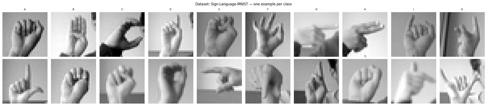
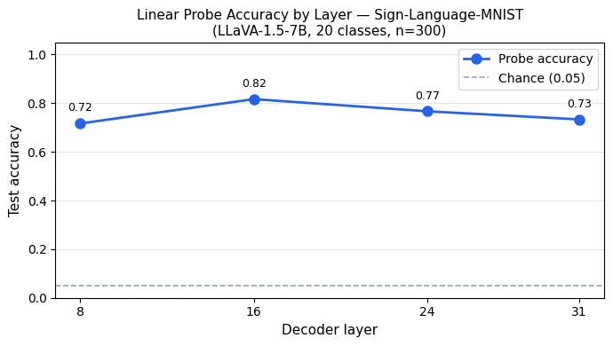
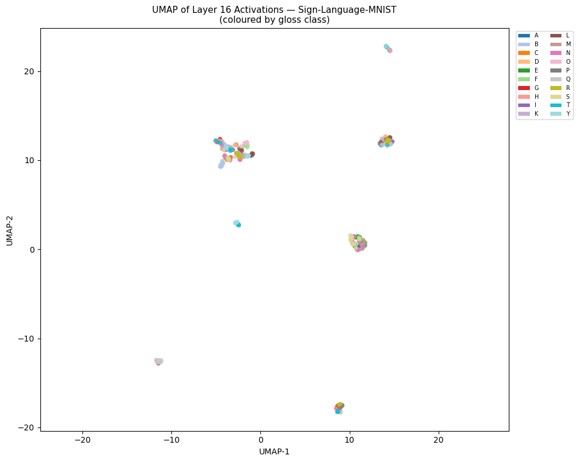
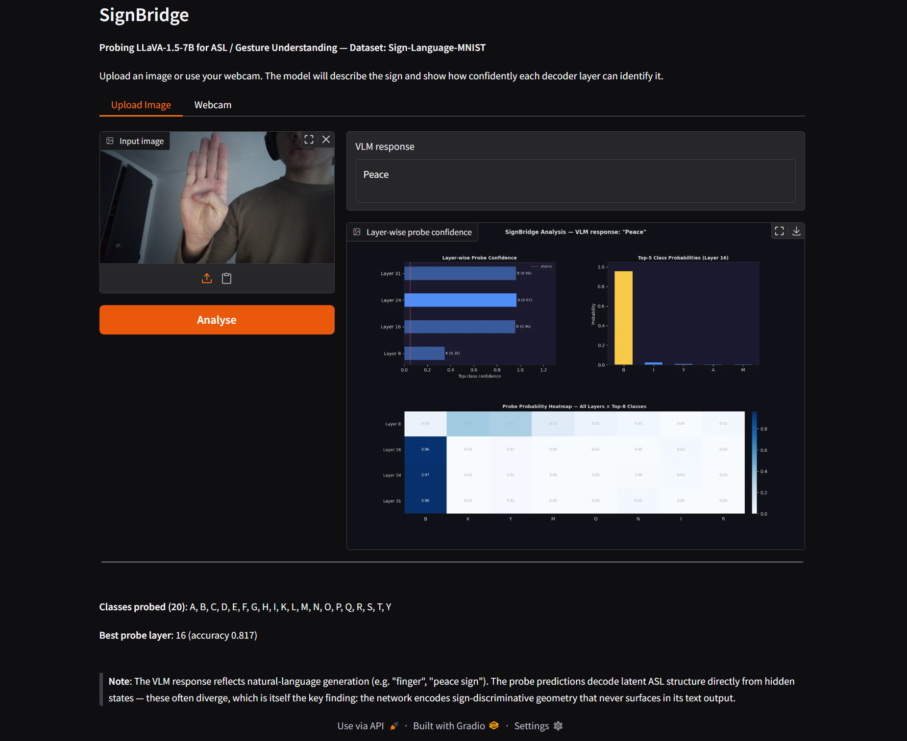

# SignBridge

Mechanistic interpretability exploration probing whether LLaVA-1.5-7B encodes ASL hand-shape structure in its language decoder layers and where that signal peaks in the network. Try it here [Demo](https://56a8bcbb412e06f1bd.gradio.live/)

## Exploration Project

Do open-source vision-language models encode hand-shape discriminative representations in their intermediate layers, even when their text output shows no sign language understanding? And if so, at which decoder layer does that signal peak?

## Key Finding

**The VLM's text output and its latent geometry tell different stories.**

When shown an ASL letter image, LLaVA generates natural-language descriptions like "finger", "peace sign", or "fist", it serves a general language model and often doesn't output ASL specific descriptions. Yet linear probes trained on its decoder activations classify the correct ASL letter with **81.7% accuracy at layer 16** (vs. 5% chance across 20 classes). The model encodes hand-shape discriminative structure in its residual stream that never surfaces in generated text.

This divergence between generation behavior and latent representation is the interesting finding.

| Layer | Probe Accuracy |
|-------|---------------|
| 8     | 72.7%         |
| 16    | **81.7%**     |
| 24    | 76.7%         |
| 31    | 73.3%         |

*All accuracies are test-set accuracy on an 80/20 stratified held-out split.*

Peak at layer 16 is consistent with probing literature (e.g. Alain & Bengio, 2016; Tenney et al., 2019) showing mid-network layers tend to hold the richest semantic representations, with later layers shifting toward generation-specific computation.

## Important Caveats

- **Dataset limitations**: Sign Language MNIST uses 28×28 grayscale stylized images, not natural photos. LLaVA was trained on natural images. The probe signal likely reflects the model encoding low-level visual features (hand shape, finger configuration) that correlate with ASL letters, rather than linguistic ASL understanding per se. Results with natural-photo datasets (WLASL, ASL Citizen) could differ substantially.
> 
- **Scale**: 300 images, 20 classes, 15 samples per class. Results are directionally strong but a larger-scale replication is warranted.
- **Probe layers**: Only 4 layers sampled (8, 16, 24, 31). A dense sweep across all 32 layers would give a more complete picture of where information peaks and decays.
- **Causality**: Linear probing establishes correlation, not causation. Activation patching would be needed to confirm that layer 16 representations causally mediate sign classification.

## Method

1. Load Sign Language MNIST (Kaggle, CC0): 34,627 28×28 grayscale ASL letter images, subsample 300 across 20 classes
2. Run LLaVA-1.5-7B (4-bit NF4 via bitsandbytes, ~12 GB VRAM) on each image with prompt: *"What sign is being made in this image? Answer with one word."*
3. Extract residual-stream activations at decoder layers 8, 16, 24, 31 via forward hooks on the last token position
4. Train L2-regularised logistic regression probes (sklearn) on 80/20 stratified splits
5. UMAP-project layer 16 activations colored by class
6. Gradio demo: image upload + webcam, with 3-panel analysis chart (layer confidence bars, top-5 class distribution, layer x class heatmap)

## Results

- **Probe accuracy at layer 16: 81.7%** (+76.7 pp above chance)
> 
- UMAP shows partially separated class structure at layer 16, suggestive but not definitive given small sample size
> 
- VLM text responses ("Peace", "Finger", "Fist") are consistently non-ASL, the hand-shape signal is latent only
> 

## Motivation

Current VLMs are not useful tools for ASL communication as their outputs carry no sign language meaning for Deaf users. This project is motivated by the question of whether that failure is purely about capability (the model has no visual understanding of signs) or partly about the gap between latent knowledge and generation (the model encodes relevant structure but doesn't surface it). The results suggest the latter is at least partially true, which has implications for how alignment and fine-tuning approaches might close this gap. That said, generalizing from 28x28 MNIST-style images to real ASL communication requires significant further work.

## Stack

- Model: `llava-hf/llava-1.5-7b-hf` (4-bit NF4, bitsandbytes)
- Dataset: [Sign Language MNIST](https://www.kaggle.com/datasets/datamunge/sign-language-mnist) (CC0)
- Probing: scikit-learn LogisticRegression, StandardScaler, StratifiedShuffleSplit
- Visualization: UMAP, matplotlib
- Demo: Gradio 4.x (image upload + webcam)
- Hardware: Google Colab H100 80GB

## Setup

```bash
# Requires a Colab H100 or equivalent GPU (~12 GB VRAM minimum)
# Open SignBridge.ipynb in Google Colab and run all cells top to bottom.
# You will need:
# - A HuggingFace token (read access) stored as Colab secret HF_TOKEN
# - A Kaggle API key stored as Colab secret KAGGLE_KEY (raw key string)
```

## Repo Structure

```
SignBridge.ipynb              # full notebook: setup → data → inference → probing → demo
README.md
class_grid.png                # one example per ASL class
probe_accuracy_curve.png      # layer-by-layer probe accuracy
umap_projection.png           # UMAP of layer 16 activations
```

## Future Work

- Run on higher-resolution natural ASL photo datasets (WLASL, ASL Citizen) for more ecologically valid results
- Dense probe sweep across all 32 layers for a complete accuracy curve
- Activation patching to test whether layer 16 representations causally mediate classification
- Compare across model families (LLaVA vs InstructBLIP vs Qwen-VL)
- Extend to ASL words and phrases, not just isolated letters
- Fine-tune on ASL data and re-probe to measure how representations shift

## References

- Alain, Guillaume, and Yoshua Bengio. “Understanding Intermediate Layers Using Linear Classifier Probes.” ArXiv.org, 22 Nov. 2018, arxiv.org/abs/1610.01644. 
- Tenney, Ian, et al. “BERT Rediscovers the Classical NLP Pipeline.” Proceedings of the 57th Annual Meeting of the Association for Computational Linguistics, 2019, https://doi.org/10.18653/v1/p19-1452.
- Liu, Haotian, et al. “Improved Baselines with Visual Instruction Tuning.” ArXiv (Cornell University), 5 Oct. 2023, https://doi.org/10.48550/arxiv.2310.03744. 